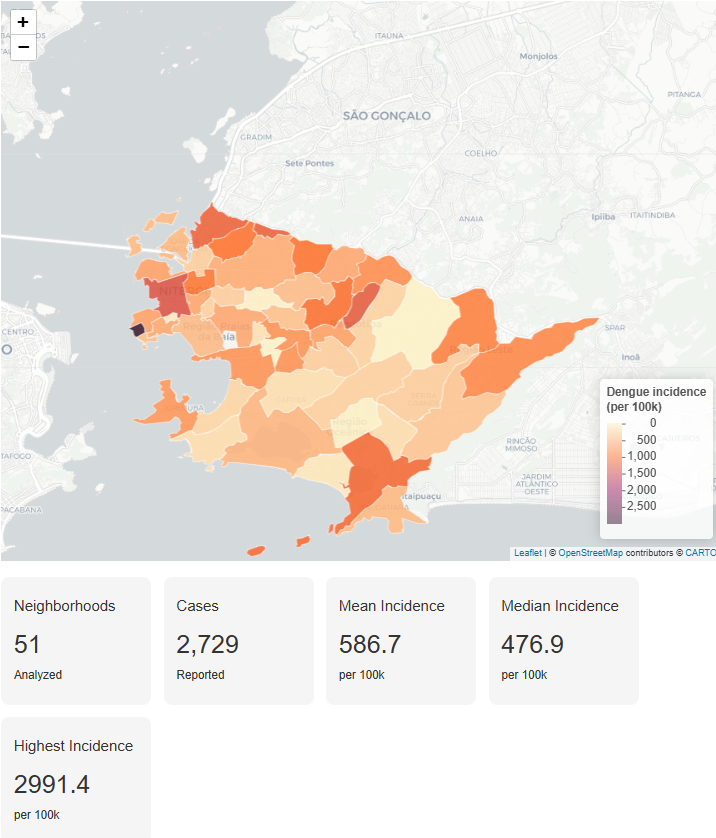

# GeoDengue: Mapping Dengue Risk Across Niterói Neighborhoods

End-to-end GIS case study demonstrating how epidemiological, demographic, and spatial data can be integrated to estimate dengue incidence and support public health decision-making.



## Overview

This project analyzes reported dengue cases in Niterói (Rio de Janeiro, Brazil) during 2024 and estimates neighborhood-level incidence rates (cases per 100,000 inhabitants).

Rather than relying on raw case counts, the analysis adjusts for population size, providing a more meaningful indicator for identifying priority areas for surveillance and vector-control actions.

## Objectives

- Clean and standardize epidemiological records
- Integrate dengue notifications with census data
- Calculate neighborhood-level incidence rates
- Produce an interactive choropleth map
- Support data-driven public health decisions

## Workflow

1.  Data cleaning and standardization
2.  Case aggregation by neighborhood
3.  Integration with population data
4.  Incidence rate calculation
5.  Spatial join with neighborhood boundaries
6.  Interactive mapping and visualization

## Tools

- R
- tidyverse
- sf
- leaflet
- ggplot2
- plotly
- R Markdown

## Repository Structure

```         
.
├── README.md
├── GeoDengue_Report.html
├── GeoDengue_Report.Rmd
├── data/
│   ├── Banco_dengue_teste.xlsx
│   ├── censo2217762015942.csv
│   └── Limite_de_Bairros.geojson
└── LICENSE
```

## Results

The analysis covers **51 neighborhoods** and demonstrates a complete GIS workflow, from raw epidemiological records to interactive spatial visualization.

Main outputs include:

- Neighborhood-level dengue incidence rates
- Interactive web map
- Top incidence ranking
- Population-adjusted epidemiological indicators

## Skills Demonstrated

- GIS Analysis
- Spatial Data Processing
- Data Cleaning & Standardization
- Spatial Joins
- Epidemiological Analysis
- Interactive Web Mapping
- Data Visualization
- Reproducible Analytics with R Markdown

## View the Report

The complete analysis is available in:

**📄 GeoDengue.html**

## Data Sources

- Dengue notification database (2024)
- Population estimates by neighborhood
- Neighborhood administrative boundaries (GeoJSON)

## License

This project is licensed under the MIT License.
